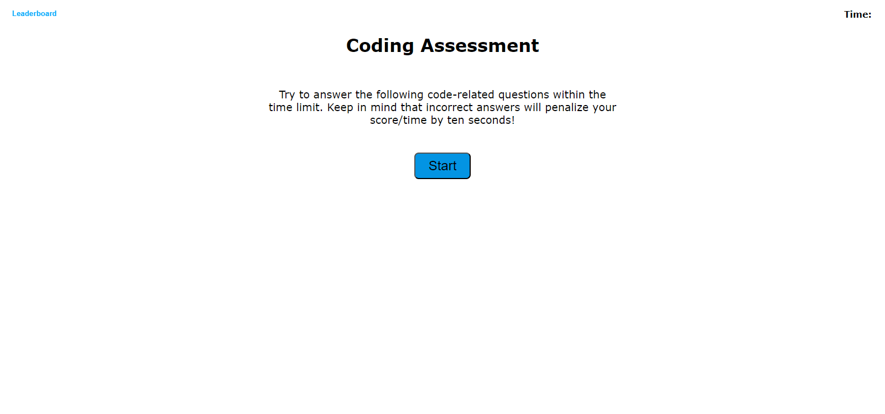

# Coding Assessment

## Description

This web application was created to provide a user with a coding assessment testing their knowledge on JavaScript fundamentals. The user is provided with five questions in a timed environment; the user's final score is determined by how much time they have left at the end, with each incorrect answer deducting 10 seconds from the timer. At the end of the quiz, the user can enter their initials and submit their score into a leaderboard, which records the users' initials and scores, ordering them from highest to lowest. 

## Installation

N/A

## Usage

Clicking on the "Start" button initiates the timer and the quiz beings. The user can then click on each multiple choice answer until they reach the end. Afterwards, they may enter their initials into the input text field and save it to the leaderboard. The user may also view the leaderboard at any time by clicking the "Leaderboard" button in the top left.

## Credits

N/A

## License

N/A